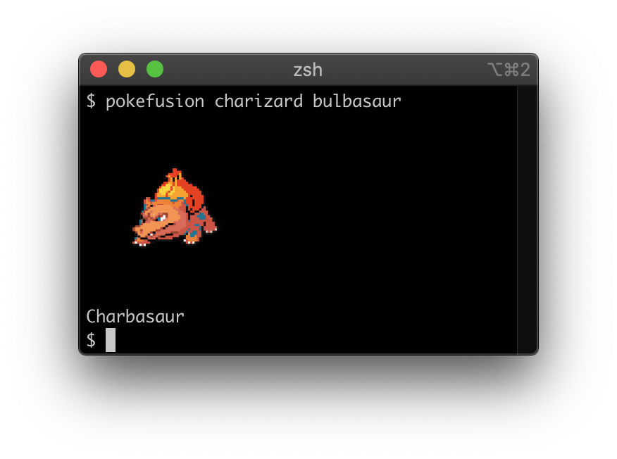

# Pokefusion

## Usage

```
$ npx pokefusion [pokemon1] [pokemon2]
```

Pokemon can be specified as names or pokedex numbers:
```
pokefusion charizard bulbasaur
pokefusion 6 1
```



## Thanks to

- [@aonsager](https://twitter.com/) for building [Pokemon Fusion](https://pokemon.alexonsager.net/), the site behind this tool.
